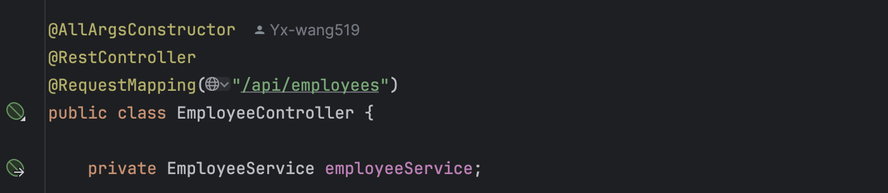
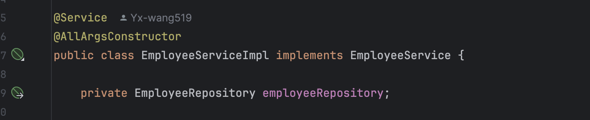

# Homework 9 — Spring IOC and Dependency Injection

## 1. What is Spring IOC?

Spring IOC is Inversion of Control, means that Spring controls the creation and management of application objects instead of developers creating them manually with the new keyword. It reduces coupling between classes and makes the application easier to maintain and test.

---

## 2. What is the IOC Container?

The IOC Container is the core part of Spring that creates, configures, stores, and manages Spring Beans. It also injects the required dependencies into those beans and controls their lifecycle.

---

## 3. What are the advantages of IOC?

IOC reduces tight coupling because classes depend on abstractions instead of creating their own dependencies. 

It also improves code reuse, maintainability, configuration management, and unit testing.

---

## 4. What is Dependency Injection?

Dependency Injection is a design pattern in which an object's dependencies are provided from outside instead of being created inside the object. In Spring, the IOC Container automatically injects the required beans into a class.

---

## 5. Dependency Injection Demo Code

Dependency Injection means that a class receives its dependencies from the Spring IOC Container instead of creating them with the `new` keyword. In this project, Spring injects `EmployeeService` into `EmployeeController` and injects `EmployeeRepository` into `EmployeeServiceImpl` through constructor injection.




The @AllArgsConstructor annotation generates constructors for these fields. Spring uses these constructors to automatically inject the required beans.

---

## 6. What are the different types of Dependency Injection?

The three main types of Dependency Injection are **constructor injection, setter injection, and field injection**. Constructor injection is generally recommended because it makes dependencies explicit and supports immutability and unit testing.

---

## 7. Pros and Cons of Constructor Injection

Prons: Constructor injection provides dependencies through the class constructor. It ensures that required dependencies are available when the object is created, supports final fields, and makes unit testing easier.

Cons: Constructors may become long when a class has too many dependencies.

```java
private final EmployeeRepository employeeRepository;

public EmployeeService(EmployeeRepository employeeRepository) {
    this.employeeRepository = employeeRepository;
}
```

---

## 8. Pros and Cons of Setter Injection

Setter injection provides dependencies through setter methods. It is useful for optional dependencies and allows dependencies to be changed after object creation.

But the object may temporarily exist without all required dependencies.

```java
private EmployeeRepository employeeRepository;

@Autowired
public void setEmployeeRepository(EmployeeRepository employeeRepository) {
    this.employeeRepository = employeeRepository;
}
```

---

## 9. Pros and Cons of Field Injection

Field injection injects dependencies directly into class fields using @Autowired. It requires less code, but it hides dependencies, makes unit testing harder, prevents the use of final fields, and is generally not recommended.

```java
@Autowired
private EmployeeRepository employeeRepository;
```


---

## 10. @Component vs @Bean

@Component is placed on a class so that Spring can automatically detect and register it during component scanning. @Bean is placed on a method inside a configuration class and is useful when developers need explicit control over object creation or when the class comes from a third-party library.

```java
@Component
public class EmailService {
}

@Configuration
public class AppConfig {

    @Bean
    public ObjectMapper objectMapper() {
        return new ObjectMapper();
    }
}
```

---

## 11. What are @Configuration and @ComponentScan?

@Configuration marks a class as a source of Spring bean definitions, usually containing methods annotated with @Bean. @ComponentScan tells Spring which packages to scan for classes annotated with @Component, @Service, @Repository, and @Controller.


---

## 12. @Controller vs @RestController

@Controller is mainly used in Spring MVC applications that return HTML pages or view names. @RestController combines @Controller and @ResponseBody, so its methods return data such as JSON directly in the HTTP response.

---

## 13. @Controller vs @Service vs @Repository

@Controller handles incoming HTTP requests and sends responses, while @Service contains business logic. @Repository handles database access and also allows Spring to translate database-related exceptions into Spring exceptions.

---

## 14. What is Spring Bean Scope?

Spring Bean scope defines how many instances of a bean Spring creates and how long each instance exists. Common scopes include singleton, prototype, request, session, application, and WebSocket.

---

## 15. Singleton vs Prototype

Singleton is the default Spring scope, and Spring creates one bean instance for each IOC Container. Prototype creates a new bean instance every time the bean is requested or injected.

---

## 16. Singleton Bean Scope Use Cases

A singleton bean is suitable for stateless services because one shared instance can safely handle many requests.

1. A service class such as EmployeeService
2. A repository class such as EmployeeRepository
3. A configuration or utility component such as an object mapper

Singleton beans should generally avoid storing request-specific mutable data because the same instance is shared across multiple threads.

---

## 17. Prototype Bean Scope Use Cases

A prototype bean is useful when each usage requires a separate object with its own mutable state.

1. A report generator with different report settings
2. A task object containing task-specific state
3. A document builder used to build separate documents

Spring creates each prototype bean, but it does not fully manage the bean's destruction lifecycle after creation.

---

## 18. Request Bean Scope Use Cases

A request-scoped bean creates one instance for each HTTP request and destroys it when the request finishes.

1. Storing request-specific user information
2. Tracking a request ID for logging
3. Collecting request-specific validation results

This scope is only available in a web application context.

---

## 19. Session Bean Scope Use Cases

A session-scoped bean creates one instance for each user HTTP session. It is useful for storing information that should remain available across multiple requests from the same user.

1. Storing a user's shopping cart
2. Storing multi-step form progress
3. Storing user-specific preferences during a session

The bean remains available until the session expires or is invalidated.

---

## 20. Session vs Cookie

A session stores user-related data on the server, while a cookie stores small pieces of data in the user's browser. Cookies are often used to store a session ID, allowing the server to identify the correct session for each request.

Sessions are generally safer for sensitive data because the actual data stays on the server. Cookies have limited storage capacity and may be modified or stolen, so secure attributes such as HttpOnly, Secure, and SameSite should be used.
